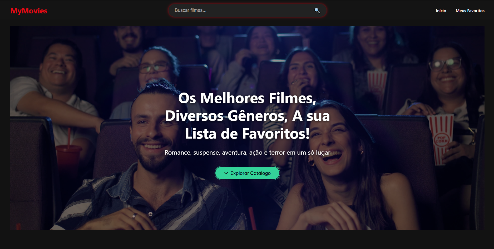
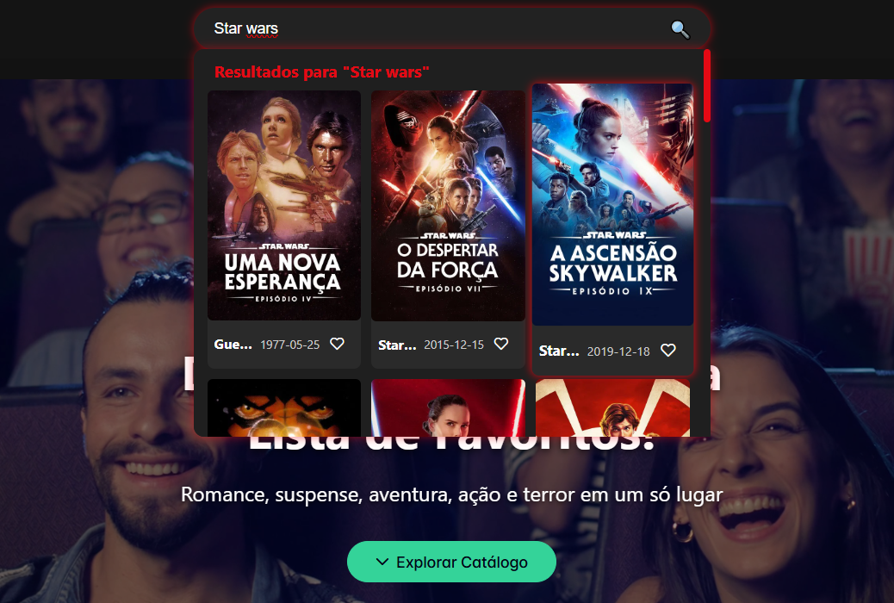
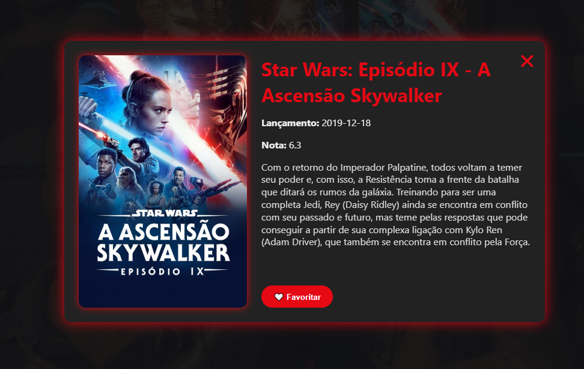
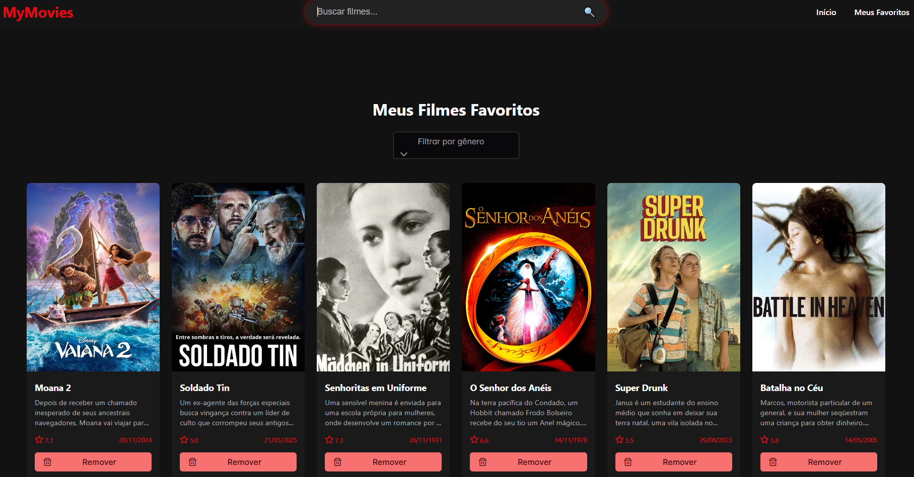
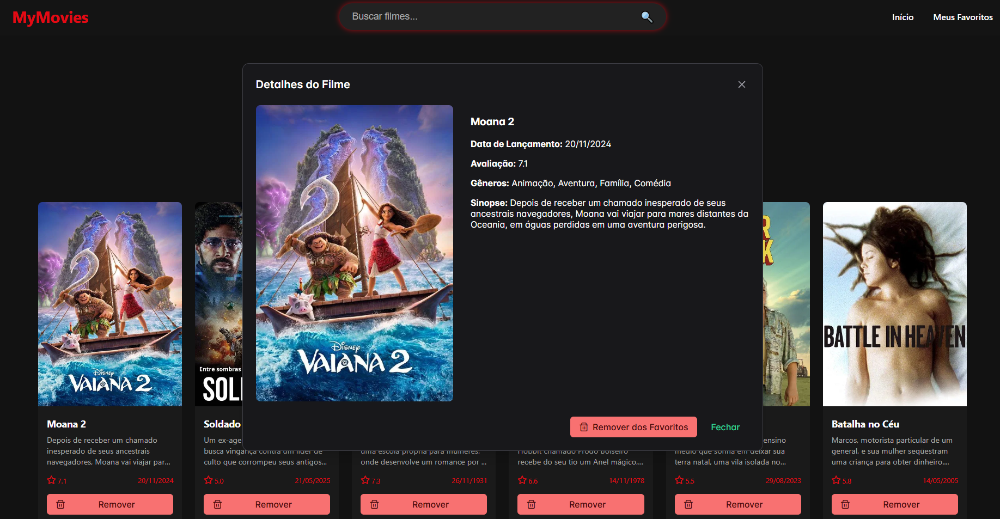

# 🎬 Teste Técnico - Desenvolvedor(a) Full Stack Júnior

Aplicação full stack de **Catálogo de Filmes**, desenvolvida com Laravel (Sail), Vue 3 e Docker. O sistema consome a API pública do The Movie Database (TMDB), permitindo busca, visualização e gerenciamento de uma lista local de filmes favoritos.

---

## 📌 Objetivo

- Buscar filmes pelo nome utilizando a API do TMDB  
- Exibir informações detalhadas dos filmes  
- Adicionar e remover filmes dos favoritos  
- Listar os filmes favoritos com filtro por gênero  

---

## ⚙ Tecnologias Utilizadas

- **Backend:** Laravel 10 com Laravel Sail  
- **Frontend:** Vue 3 (SPA)  
- **Banco de Dados:** MySQL  
- **Ambiente:** Docker / Docker Compose  
- **Versionamento:** Git (GitHub)  

---

## 🐳 Como rodar o projeto com Docker

### Requisitos

- Docker + Docker Compose instalados na máquina

### Clonando o repositório

```bash
git clone https://github.com/seu-usuario/seu-repositorio.git
cd seu-repositorio
Backend (Laravel Sail)
Copie o .env:

bash
Copiar
Editar
cp .env.example .env
Instale as dependências do Laravel:

bash
Copiar
Editar
composer install
Suba o ambiente:

bash
Copiar
Editar
./vendor/bin/sail up -d
Gere a chave da aplicação:

bash
Copiar
Editar
./vendor/bin/sail artisan key:generate
Rode as migrations:

bash
Copiar
Editar
./vendor/bin/sail artisan migrate

🖥️ Frontend (Vue.js)

Acesse a pasta do frontend:

bash
Copiar
Editar
cd frontend
Instale as dependências:

bash
Copiar
Editar
npm install
Inicie o servidor de desenvolvimento:

bash
Copiar
Editar
docker build -t vue-frontend .

docker run -p 8080:80 vue-frontend

O frontend estará disponível em http://localhost:8080/

🔑 Chave da API TMDB

Você precisa de uma API Key do The Movie Database (TMDB):

Crie uma conta gratuita em: https://www.themoviedb.org/

Acesse seu perfil → Settings > API

Gere uma API Key v3

Adicione sua chave no arquivo .env do Laravel:

env
Copiar
Editar
TMDB_API_KEY=sua_chave_aqui

🧱 Estrutura do Projeto

Backend (Laravel)
Rotas: routes/api.php

Controller: app/Http/Controllers/API/MovieController.php

Model: app/Models/FavoriteMovie.php

Frontend (Vue)
Página inicial: vue-frontend/src/views/HomeView.vue

Busca: vue-frontend/src/App.vue

Favoritos: vue-frontend/src/views/FavoritesView.vue

Cards e modal: vue-frontend/src/components/MovieCard.vue, vue-frontend/src/components/FavoriteMovieCard.vue

API: vue-frontend/src/api/index.js, vue-frontend/src/api/tmdb.js

Config NGINX: vue-frontend/nginx.conf

🧪 Testando a Aplicação

Backend
API de busca de filmes:

http
Copiar
Editar
GET http://localhost/api/movies/search?query=batman
Frontend
Acesse via navegador: http://localhost:8080

Funcionalidades a testar:

Buscar filmes pelo nome

Ver detalhes do filme via modal

Adicionar/remover favoritos

Acessar lista de favoritos e filtrar por gênero


🏠 Tela Inicial



Exibe três categorias de filmes: mais populares, melhor avaliados e lançamentos.


🔍 Busca de Filmes



A barra de busca retorna filmes com base no nome digitado.


🎬 Detalhes do Filme



Modal com sinopse, nota, botão de favoritar e pôster.


⭐ Favoritos



Lista local de filmes favoritos com filtro por gênero.


📄 Detalhes do Filme Favorito



Visualização detalhada dentro da aba de favoritos.


📚 Documentação da API TMDB
Acesse a documentação oficial da API em:
👉 https://developer.themoviedb.org/reference/intro/getting-started

👨‍💻 Autor(a)
Este projeto foi desenvolvido como parte de um teste técnico para vaga de Desenvolvedor(a) Full Stack Júnior.